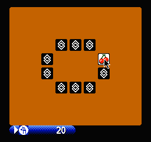

# Magnes

[Magnes](https://magnes.jauhar.dev) is NES (Nintendo Entertaiment System) emulator written in [Magelang](https://github.com/jauhararifin/magelang).

This project is in WIP state.

## Screeshots





## Compiling

To compile this game, you must first install the Magelang compiler.

1. Before installing Magelang, make sure you have the following tools installed:
    - Git
    - [Rust](https://www.rust-lang.org/tools/install) and [Cargo](https://github.com/rust-lang/cargo)
    - [NPM](https://www.npmjs.com/) (Optional).

2. Installing magelang compiler

```bash
# At the time of writing this project, Magelang has not been officially released.
# The game was compiled using Magelang with this commit ID: aa6460315e276a25263eb56b3ff558a03273f9e6.
# Use this commit ID to install Magelang to ensure version compatibility.
cargo install \
    --git https://github.com/jauhararifin/magelang.git \
    --rev aa6460315e276a25263eb56b3ff558a03273f9e6 \
    magelang

# Verify the installation
magelang --version
```

3. Run the build script

```bash
# Clone the flappybird repository
git clone https://github.com/jauhararifin/magnes.git
cd magnes

# Execute the build script:
bash ./build.sh
```

After running this script, you should see a `./build` directory in your current working directory, containing all the files required to run the game.
Checkout `./build/platform/web/` directory to run it on the web.

## Running

1. Serve the build directory using an HTTP server. You can use the `http-server` package from NPM for this purpose.

```bash
npx http-server ./build/platform/web/  -p 8080
```

2. Open your browser and navigate to http://localhost:8080.

## Demo

Checkout the demo [here](https://magnes.jauhar.dev).

## Reference

- [6502 CPU Reference](https://www.masswerk.at/6502/6502_instruction_set.html#opcodes-footnote2)
- [Nesdev Wiki](https://www.nesdev.org/wiki)
